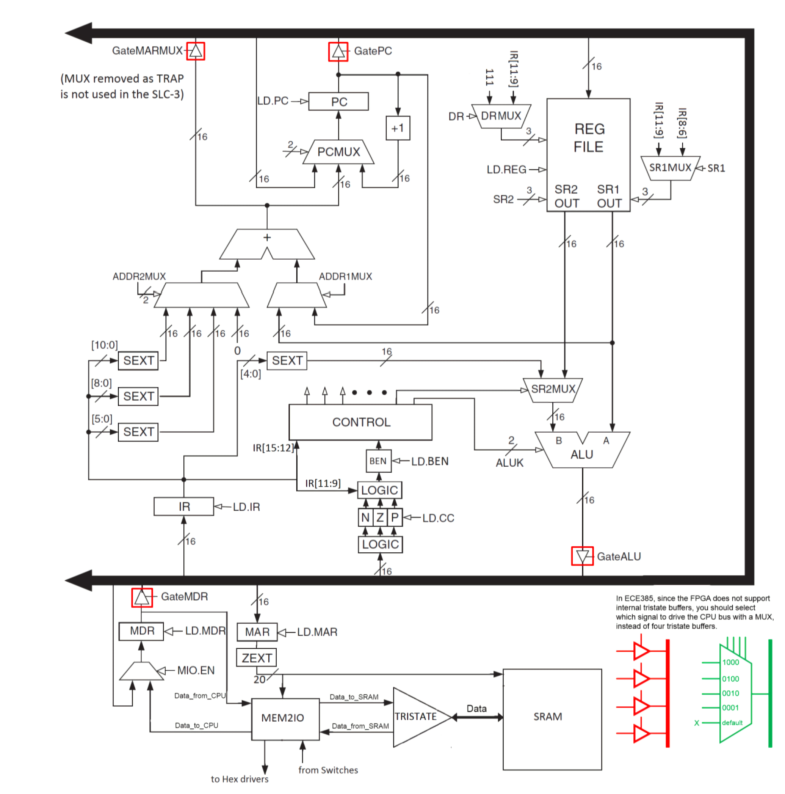

# ECE385 Fall 2021
## Microprocessor with LC3 ISA

**©  [Fan Yang](https://github.com/fan19-hub) © [Chang Su](https://github.com/fan19-hub) © [Ziwen Wang](https://github.com/ziwenwang5)**

**Warning: The use of this program for Academic Plagiarism will be severely condemned. However, we encourage you to borrow ideas and use them in your final project**

### **INTRODUCTION:**   

In this lab we intergrate the preceding lab to build a simple microprocessor based on SystemVerilog. The main components of the desgin consist of the central processing unit, the memory that stores data and instruction and the I/O interface. 

In another instance, we can also generalize them into FETCH, DECODE, EXECUTE three parts, where FETCH can store the memory address from MAR and loads instructions in M[MAR] into MDR, and finally store the content in MDR into IR, DECODE can read instructions from IR and decode it, EXECUTE can make a calculation or load/store operation bades on given FETCH, DECODE signals. 

Each instruction is 16 bits, where 4 bits [15:12] are used to identify the operation and the last 12 bits are thought as relavant inputs for the operation. Available instructions are ADD, ADDi, AND…etc, as the folloing figure showing, satisfying the basic demand for computing.

### **Description and Diagrams of SLC-3**	
##### **Summary of Operation & Functionality**

The SLC-3 circuit we build is just to simulate the lc-3 machine. The ISDU module is just the control part in the SLC-3 block diagram. It controls the behavior of other parts of lc-3 machine. The inputs of ISDU module, especially the Opcode, determine the current state of the SLC-3 machine. And for different state, the outputs will be sent to the everywhere in the circuit to control the whole operation of the circuit. Most importantly, its outputs control the flow of the data in the datapath. That’s because the GateMARMUX, GateMDR, GateALU and GatePC signal controls which data flows into the bus while LD\_IR, LD\_MAR, LD\_MDR, LD\_REG signals controls where the data should flow in. At the same time, at most one Gate signal is active and at most one LD signal is active. That ensures at the same state the flow direction of the data is always certain. Besides, other outputs of the ISDU controls the behaviors of other parts in the circuit, especially the MUX. Then, for different functions, the state transformation is certain and then the outputs are certain. As a result of that, the flow direction of the data in the bus and out of the bus are certain. In this way, SLC-3 performs its functions. 

In the Fetch-Decode-Execute cycle, the briefly interrelation can be seen in the following figure. 

Specifically, for the FETCH operation, it will firstly read and store PC into MAR, memory address register. And then it will read and store the data in address of MAR, namely, M(MAR), into MDR, the memory data register. Finally, the content of MDR will be stored into IR as instruction, and PC will move to the next location, i.e. PC=PC+1. 

For the DECODE operation, it will first read the instruction from IR which is stored by the FETCH. Then it will go through the state machine from ISDU module. By the operation and the next state set in each state, it can do the full procedures demanding for DECODE. 

For the EXECUTE operation, it will perform the instructions read from DECODE and execute it. The result will be stored into the desination register or memory. 

The SLC-3 can do the following functions: 

ADD: add the contents of SR1 and SR2 together, and store the result in DR. Sets CC. 

ADDi: add the contents of SR1 and the immediate value, and sotre the result in DR. Sets CC. 

AND: do a bitwise AND operation between the contents of SR1 and SR2, and store the result in DR. Sets CC.

ANDi: do a bitwise AND operation between the contents of SR1 and immediate value, and store the result in DR. Sets CC. 

NOT: do a bitwise NOT operation to SR1, and store the result in DR. Sets CC.

BR: if any of the conditional code matches the value stored in the status register, it will jump to aimed address, or it will just ignore the code. The aimed address is determined by adding the SEXT Pcoffset9 to PC. 

JMP: assign the memory address from BaseR to PC. 

JSR: store PC to R7, and then add the SEXT Pcoffset11 to PC. 

LDR: assign the sum of the address of SR and SEXT Offset6 to PC to DR.

STR: store the the sum of the address of SR and SEXT Offset6 to PC to DR.

PAUSE: pause execution until Continue is offered by the user. 

##### **Written Description of all .sv Modules**

**a.** 

Module:​ tristate.sv 

Inputs:​ [15:0] Data\_write, Clk, tristate\_output\_enable 

Outputs:​ [15:0] Data\_read

Inout: [15:0] Data

Description:​ This is a tristate buffer which processes 16-bit input and output. 

Purpose:​ This module is used to read data from the bus, updated with the data from Mem2IO which will be written to the bus and drive Data bus only when tristate\_output\_enable is active.

**b.**

Module: register.sv 

Inputs: [15:0] D, Clk, Reset,Load

Outputs: [15:0] out

Description: This is a 16-bit synchronous register.

Purpose: This module is used to store the data in the 16-bit register. If the Reset signal is active, the data in the register will be 0.

**c.**

Module: register\_file.sv 

Inputs: [15:0] D, Clk, Reset, LD\_REG, [2:0] SR1,SR2,DR

Outputs: [15:0] SR1\_out, SR2\_out

Description: This is the REG FILE part in the slc-3 block diagram. 

Purpose: In this module there are 8 registers representing R0 to R7 respectively. When LD\_REG is active, the data will be loaded to one of R0 to R7. That depends on the value of DR. SR1 signal controls transfer which register to the SR1\_out while SR2 controls the SR2\_out.

**d.** 

Module: mux2\_1.sv 

Inputs: select, [2:0]A, B

Outputs: [2:0]Out

Description: This is the 2-1 mux with 3-bit input and output.

Purpose: It uses the select signal to choose between input A and B. When select is 0, the out is A while 1 is B.

**e.** 

Module: mux2\_1\_16bits.sv 

Inputs: select, [15:0]A, B

Outputs: [15:0] Out

Description: This is the 2-1 mux with 16-bit input and output.

Purpose: It uses the select signal to choose between input A and B. When select is 0, the out is A while 1 is B.

**f.**

Module: mux3\_1.sv 

Inputs: [1:0] select, [15:0] A0, A1, A2

Outputs: [15:0] Out

Description: This is the 3-1 mux with 16-bit input and output.

Purpose: It uses the select signal to choose between input A0, A1 and A2. When select is 0, the out is A0; select is 1, the out is A1. For other case, the out is A2.

**g.**

Module: mux4\_1.sv 

Inputs: [1:0] select, [15:0] A0, A1, A2, A3

Outputs: [15:0] out

Description: This is the 4-1 mux with 16-bit input and output.

Purpose: It uses the select signal to choose between input A0, A1, A2 and A3. When select is 0, the out is A0; select is 1, the out is A1; select is 2, the out is A2. For other case, the out is A3.

**h.**

Module: Mem2IO.sv 

Inputs: Clk, Reset, [19:0] ADDR, CE, UB, LB, OE, WE, [15:0]  Switches, Data\_from\_CPU, Data\_from\_SRAM

Outputs: [15:0] Data\_to\_CPU, Data\_to\_SRAM, [3:0] HEX0, HEX1, HEX2, HEX3

Description: This is the Mem2IO part in the slc-3 block diagram.

Purpose: It passes data from CPU to SRAM without change. Second, when WE is not active and OE is active, it loads data from switches when address (data from MAR) is xFFFF, and from SRAM otherwise. The data will transfer to CPU later. Third, when the reset is not active it writes 0 to LEDs while it writes data from CPU to LEDs when WE is active and address is xFFFF(data from MAR).

**i.**

Module: ISDU.sv

For other information, please refer to the 2.4 part of the report. 

**j.**

Module: ALU.sv 

Inputs: [1:0] ALUK, [15:0] A, B

Outputs: [15:0] S

Description: This is the ALU part in the slc-3 block diagram.

Purpose: It uses the ALUK signal to choose how to execute A and B. When ALUK is 0, the out S is A+B; ALUK is 1, the out S is A&B; ALUK is 2, the out S is ~A. For other case, the out is A.

**k.**

Module: CC.sv 

Inputs: LD\_CC, Clk, [15:0] Data\_from\_BUS

Outputs: [2:0] nzpvalue

Description: This is used to calculate the value of nzp for the BEN part. 

Purpose: It execute the data from the bus. When it is positive, the nzpvalue is 001; when it is 0, the nzpvalue is 010. When it is negative, the nzpvalue is 100.

**l.**

Module: BEN\_M.sv 

Inputs: LD\_BEN, Clk, [15:0]IR, [2:0] nzpvalue

Outputs: BEN

Description: This is used to calculate the value of BEN for the BR instruction. 

Purpose: Get the value for BEN using nzpvalue and IR. If the (nzpvalue &IR[11:9]!=0), then BEN is 1, otherwise 0. 

**m.**

Module: datapath.sv 

Inputs: Clk, Reset, GateMARMUX, GateMDR, GateALU, GatePC, MIO\_EN, LD\_IR, LD\_MAR, LD\_MDR, LD\_PC, LD\_CC, LD\_BEN, LD\_LED, LD\_REG, SR1MUX,SR2MUX,DRMUX,ADDR1MUX, [1:0] PCMUX,ADDR2MUX,ALUK, [15:0] MDR\_In

Outputs: BEN, [15:0] PC, IR, MAR, Data\_from\_BUS, MDR, [11:0] LED

Description: This is the module for the datapath part of whole slc-3 exclude MEM2IO, tristate and SRAM. 

Purpose: It builds the whole datapath for the slc-3 circuit. In it, it also extend IR[5:0], IR[8:0] and others to 16-bit data. It uses other module to create all the parts we need and connect them. Besides, it also transfer the IR[11:0] to the LED to show it. And it also controls GateMARMUX, GataMDR, GateALU and GatePC to select which data will be transferred to the bus. 

**n.**

Module: slc3.sv 

Inputs: Clk, Reset, Run, Continue, [15:0] S

Outputs: [11:0] LED, [6:0] HEX0, HEX1, HEX2, HEX3, HEX4, HEX5, HEX6, HEX7, CE, UB, LB, OE, WE, [19:0] ADDR

Inout: [15:0] Data

Description: This is the module for the whole slc-3 circuit. In other words, it connects the datapath part with MEM2IO, tristate and SRAM.

Purpose: It builds the whole slc-3 circuit. Besides, it also transfer the data to the hexdrivers so that we can see it from the FPGA board. 

1) !
[日程表低可描述已自动生成](md_pic/Aspose.Words.41851d8e-a226-459d-b8a8-b2ffdb871d67.004.png)**Block Diagram of slc3.sv**
##### **Description of the operation of the ISDU (Instruction Sequence Decoder Unit)**

ISDU uses a state machine consists of a series of state by sequence. For some states, especially for state 32, a state will be followed by various states differentiated by a 4-bit opcode. Specifically, opcode 0001 refers to ADD, 0101 to AND, 0110 to LDR, 0111 to STR, 0100 to JSR, 1100 to JMP, 0000 to BR, 1101 to PAUSE. 

In each state, the information of the next state will be contained and the basic operation will be executed to change some status of some labels. 

##### **State Diagram of ISDU**

### **Simulations of SLC-3 Instructions**

### **Post-Lab Questions**

` `**(1)  Fill out the Design Resources and Statistics table from Post-Lab question one**

|LUT|588|
| :-: | :-: |
|DSP|0|
|Memory (BRAM)|0|
|Flip-Flop|268|
|Frequency|90\.99MHz|
|Static Power|98\.63mW|
|Dynamic Power|0\.00mW|
|Total Power|167\.92mW|

**(2) Answer the following two questions**

**What is the function of the MEM2IO.sv module?**

What is the function of the MEM2IO.sv module?

First, MEM2IO.sv passes data from CPU to SRAM without change. Second, when WE is not active and OE is active, it loads data from switches when address (data from MAR) is xFFFF, and from SRAM otherwise. The data will transfer to CPU later. Third, when the reset is not active it writes 0 to LEDs while it writes data from CPU to LEDs when WE is active and address is xFFFF(data from MAR). 

**What is the difference between the BR and JMP instructions?**

BR instruction means that if (nzp&IR[11:9]!=0), then PC will become PC+IR[8:0]. JMP instruction means that PC will be loaded with the value in the register IR[8:6].

They are two totally different instructions, the new value of PC for BR instruction is based on the initial value of PC while the new value of PC for JMP instruction is only depended on the value stored in the register. 

### **Conclusion**
   ##### **Discuss functionality of your design. If parts of your design didn’t work, discuss what could be done to fix it**

In this lab we successfully design the simple computer SLC-3 baesed on SystemVerilog. The SLC-3 manage to realize aimed functions: ADD, AND, NOT, BR, JMP, JSR, LDR, STR and PAUSE via the interconnection among FETCH, DECODE and EXECUTE. 

##### **Was there anything ambiguous, incorrect, or unnecessarily difficult in the lab manual or given materials which can be improved for next semester? You can also specify what we did right so it doesn’t get changed.**

This lab is quite comprehensive and sophisticated, demanding a deep understanding into the whole parts of SLC-3 as well as what we do in previous lab. When debugging, we find some bugs are caused by non-understanding the functions of some labels. In general, this experiment well improves our coding and debugging ability. 
